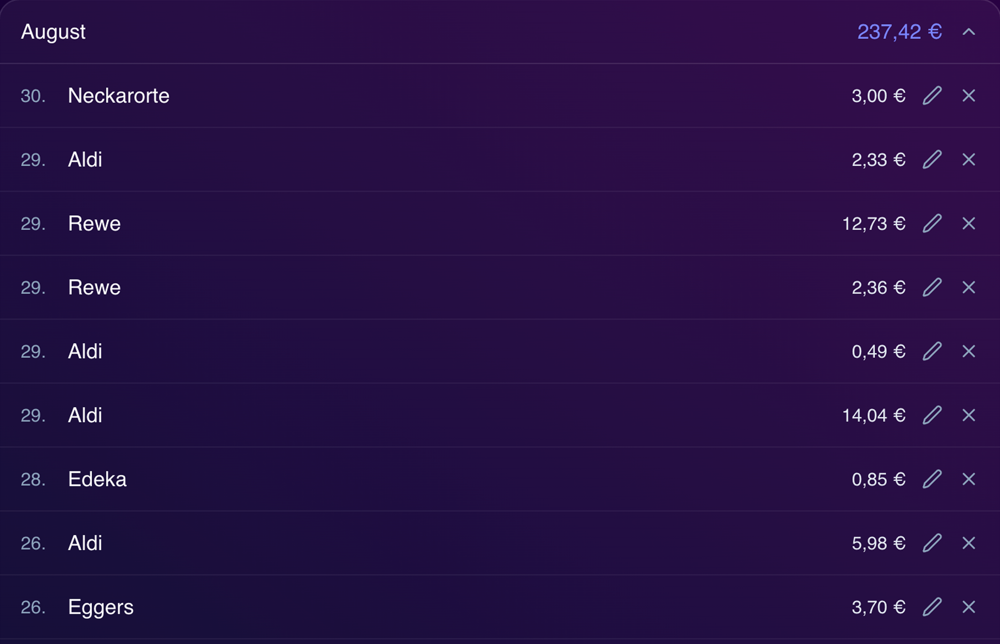
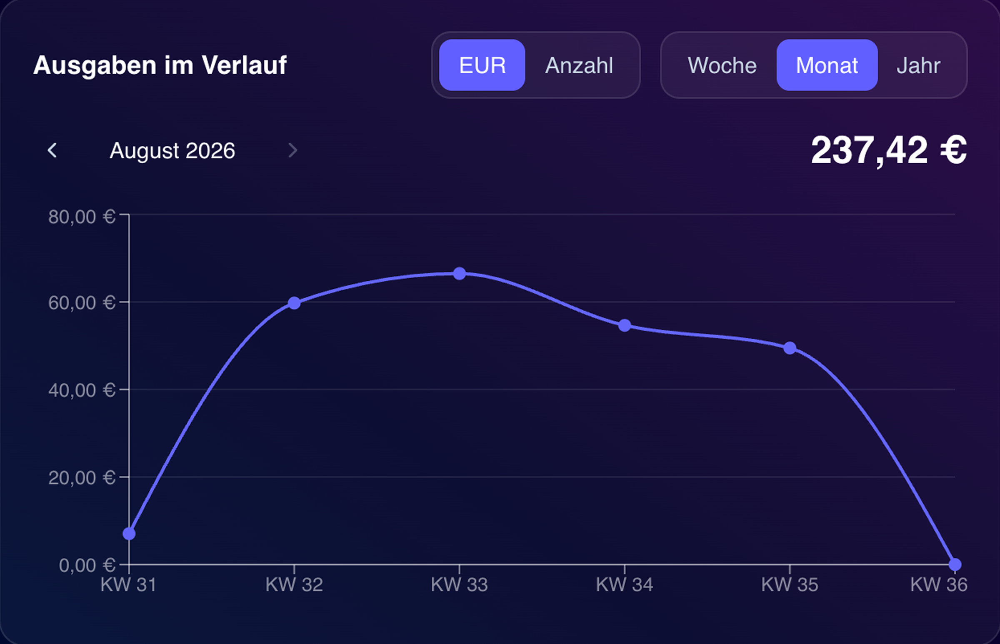

# kassenzettel

A simple expense-tracking web app for keeping an eye on grocery spending. Log purchases as you make them and see how much you're actually spending each month, as a list or as a chart.

**Live app:** [kassenzettel.my-semmy.com](https://kassenzettel.my-semmy.com)

Try it without signing up — there's an interactive demo on the landing page.

## Features

- **Manual expense entry** — log the store, amount, and date for each purchase
- **List view** — browse expenses grouped by year and month
- **Analytics view** — visualize spending trends over time
- **Authentication** — email/password or Google Auth via Supabase
- **No-signup demo** — try the full flow on the landing page before creating an account
- **Multi-language support** — available in German, English, and Turkish
- **Account management** — change password, delete account, all self-service

## Tech stack

- [Next.js](https://nextjs.org) + [React](https://react.dev) + [TypeScript](https://www.typescriptlang.org)
- [Tailwind CSS](https://tailwindcss.com)
- [Supabase](https://supabase.com) — authentication, PostgreSQL database, row-level security
- [TanStack Query](https://tanstack.com/query) — optimistic UI updates on data entry
- [next-intl](https://next-intl.dev) — internationalization
- [Zod](https://zod.dev) — form and input validation
- Deployed on [Vercel](https://vercel.com)

## Screenshots

  
  

## License

This project is not currently licensed for reuse. Feel free to look around, but please don't reuse the code without asking first.